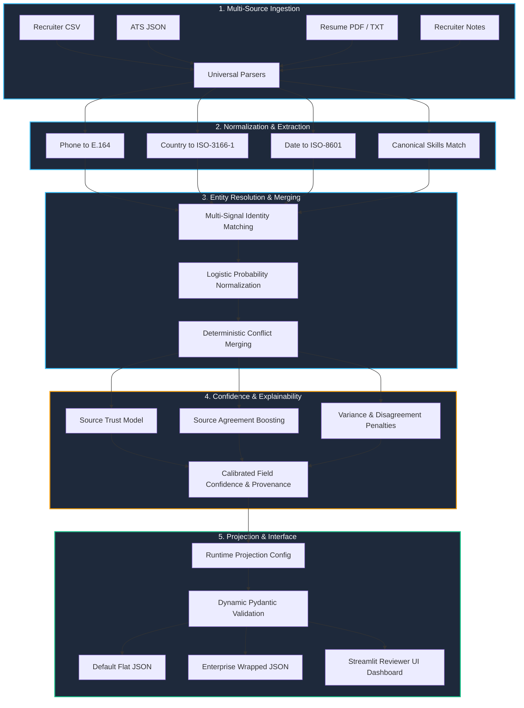
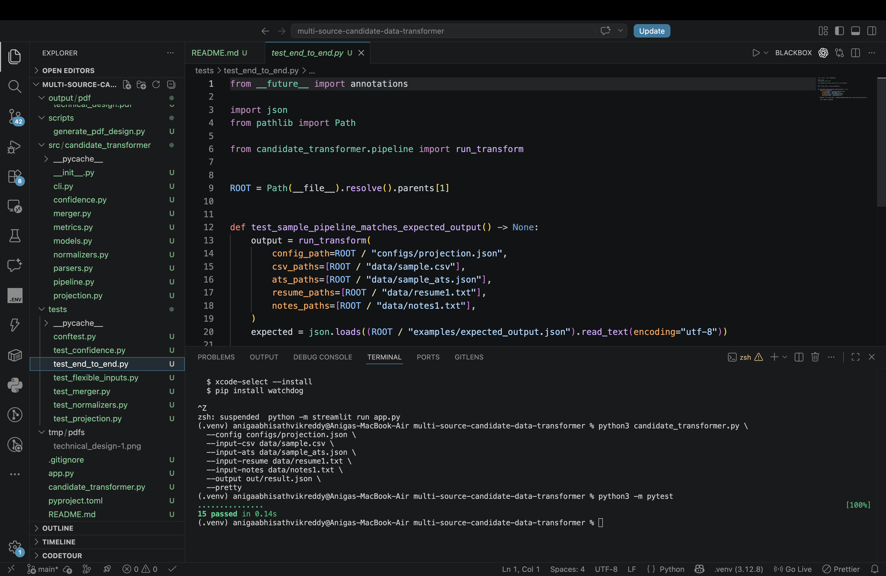
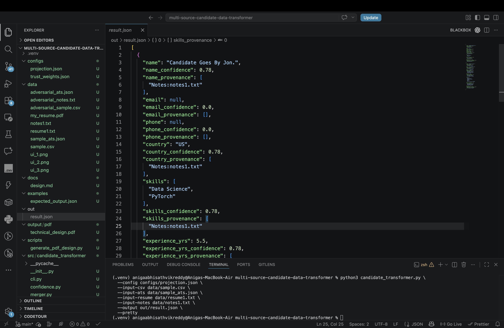
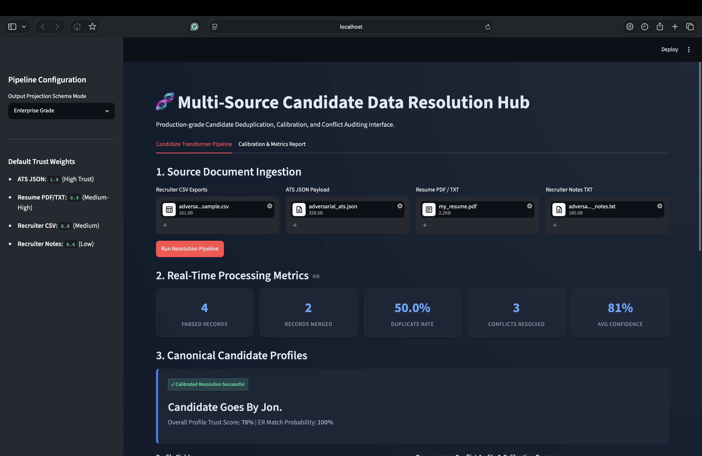
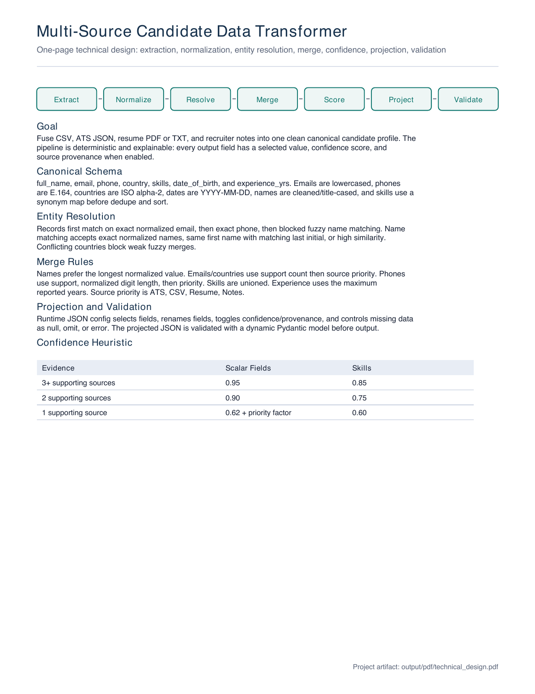

# Multi-Source Candidate Data Transformer & Reviewer Hub

A production-grade, end-to-end Master Data Management (MDM) pipeline that ingests, extracts, normalizes, resolves, merges, and validates candidate data from structured (CSV, ATS JSON) and unstructured (Resume PDF/TXT, Recruiter Notes) source documents.

Includes a **Calibrated Confidence Engine**, **Multi-Signal Identity Resolution**, **Explainability Logs**, and a **Streamlit Reviewer UI**.

---

## 🧬 Data Resolution Pipeline



---

## ✨ Key Features

1. **Calibrated Confidence Engine**: Baseline confidence increases with source agreement (1 source = 85%, 2 sources = 92%, 3 sources = 96%, 4 sources = 99%) modulated by source trust weights.
2. **Source Trust Model**: Configurable source weights (ATS = 1.0, Resume = 0.95, CSV = 0.90, Notes = 0.80) configured via `configs/trust_weights.json`.
3. **Variance/Disagreement Penalties**: Applies statistical confidence penalties when sources report conflicting numerical (e.g. experience years) or string (e.g. name variants) values.
4. **Multi-Signal Identity Resolution**: Computes pairwise records matching probability using weighted signals (email, phone, name, country, experience, skills) mapped through a logistic sigmoid function.
5. **Evidence-Based Explainability**: Tracks and emits detailed text reasoning logs detailing why a field value was selected, which sources supported it, and how the confidence score was calibrated.
6. **Enterprise-Grade Output Model**: Supports wrapping each field in a metadata block with values, calibrated confidence, source tags, trust scores, and evidence logs.
7. **Streamlit Reviewer UI Dashboard**: An interactive, modern dashboard to upload files, view pipeline metrics, audit conflicts, view field reasoning, and manage the manual review queue.
8. **Manual Review Routing**: Automatically flags resolved profiles with low overall confidence (< 75%) for manual human verification.
9. **Dynamic Pydantic Validation**: Generates dynamic runtime schemas to validate projected candidates against configured schemas.
10. **Robust PDF / TXT Parsing**: Ingests resume files and recruiter notes, extracting names, aliases, emails, phones, skills, countries, and experience.
11. **Deterministic Ties Resolution**: Merges duplicate fields deterministically by support frequency, source priority, and string length.

---

## 📁 Repository Structure

```text
candidate_transformer.py        # CLI Entry Point
Technical_Design_Eightfold.pdf  # Stage 1 Technical Design
app.py                          # Streamlit Reviewer Hub UI Dashboard
scripts/
  generate_pdf_design.py        # Technical Design PDF Generator
src/candidate_transformer/
  cli.py                        # argparse CLI entry point
  confidence.py                 # trust models, agreement boosting, penalties
  metrics.py                    # operational pipeline metrics calculations
  models.py                     # Pydantic CandidateProfile & SourceRecord models
  normalizers.py                # email, phone, country, date, skill normalization
  parsers.py                    # CSV, ATS JSON, resume (PDF/TXT), notes parsers
  merger.py                     # multi-signal ER matching and conflict merging
  projection.py                 # config-driven output projection & validation
  pipeline.py                   # top-level orchestration
configs/
  projection.json               # schema projection config
  trust_weights.json            # source trust config
data/
  sample.csv                    # sample Recruiter CSV exports
  sample_ats.json               # sample ATS JSON payloads
  resume1.txt                   # sample Resume document
  notes1.txt                    # sample Recruiter Notes document
  screenshot_ui.png             # UI Dashboard Screenshot (Inserted by user)
examples/
  expected_output.json          # expected CLI demo output JSON
tests/
  test_confidence.py            # tests trust weights, boosting, and metrics
  test_merger.py                # tests entity resolution and record grouping
  test_end_to_end.py            # tests full pipeline matches
  test_flexible_inputs.py       # tests flexible parser ingestions
  test_projection.py            # tests schema mapping & validations
```

---

## 🚀 Execution & Command Reference

### 1. Environment Installation
Install the required packages within a Python virtual environment:
```bash
python3 -m venv .venv
source .venv/bin/activate
python -m pip install -r requirements.txt
```

### 2. Run the CLI Demo Pipeline
Run the transformer pipeline across all sample sources and output a pretty-printed JSON file:
```bash
python candidate_transformer.py \
  --config configs/projection.json \
  --input-csv data/sample.csv \
  --input-ats data/sample_ats.json \
  --input-resume data/resume1.txt \
  --input-notes data/notes1.txt \
  --output out/result.json \
  --pretty
```

### 3. Launch the Streamlit Reviewer UI
Launch the interactive dashboard locally:
```bash
python3 -m streamlit run app.py
```

### 4. Run the Automated Test Suite
Verify pipeline, normalizers, and confidence calibrations:
```bash
python3 -m pytest -v
```

---

## 🧪 Comprehensive Test Cases

| Test File | Focus Area | Verifies |
| --- | --- | --- |
| `test_confidence.py` | Calibration Engine | Agreement boosting tiers, trust weights, numeric/string variance penalties, Brier calibration score, and F1 calculations. |
| `test_merger.py` | Deduplication | Multi-signal entity resolution matching, record grouping, and conflict-merging policies. |
| `test_flexible_inputs.py` | Ingestion Layers | Parsing from raw PDF/TXT resumes, recruiter notes files, and structured formats without creating false duplicate candidates. |
| `test_projection.py` | Projection Layer | Schema aliases (e.g. `from`), output normalizations, and missing field behavior (`omit`, `null`, `error`). |
| `test_end_to_end.py` | Pipeline E2E | End-to-end alignment of the sample files with the expected output dictionary. |

---

## 📝 Showcase: Sample Input vs Produced Outputs

### Sample Inputs
1. **Recruiter CSV (`data/sample.csv`)**: Contains `Jonathan A. Doe Jr.` with phone `650.555.1234` and email `j.doe+careers@gmail.com`.
2. **ATS JSON (`data/sample_ats.json`)**: Contains `Jon Doe` with phone `+1 (650) 555-1234` and email `john.doe@gmail.com`.
3. **Resume TXT (`data/resume1.txt`)**: Contains `Jonathan Andrew Doe` with phone `+1-650-555-1234` and email `J.DOE@gmail.com`.
4. **Recruiter Notes (`data/notes1.txt`)**: Contains name alias `Jon.`, skills `Data Science, PyTorch`, and experience `5.5 years` located in California.

---

### Produced Outputs

#### A. Default Flat Output Format
Produced by default or when `output_format: "flat"` in the projection config. Emits fields and metadata keys as sibling properties:
```json
[
  {
    "name": "Jonathan A. Doe Jr.",
    "name_confidence": 0.68,
    "name_provenance": [
      "CSV:sample.csv#row1"
    ],
    "email": "john.doe@gmail.com",
    "email_confidence": 0.72,
    "email_provenance": [
      "ATS:sample_ats.json#1"
    ],
    "phone": "+16505551234",
    "phone_confidence": 0.94,
    "phone_provenance": [
      "CSV:sample.csv#row1",
      "ATS:sample_ats.json#1",
      "Resume:resume1.txt"
    ]
  }
]
```

#### B. Enterprise-Grade Output Model
Produced when `output_format: "enterprise"` is configured. Wraps each field in a metadata block detailing value, confidence, sources, and explainability reasoning logs:
```json
[
  {
    "name": {
      "value": "Jonathan A. Doe Jr.",
      "confidence": 0.68,
      "sources": ["CSV:sample.csv#row1"],
      "evidence": [
        "Present in 1 source(s) → agreement base 0.85",
        "Trust-weighted score: 0.90",
        "Conflict penalty: -0.13 (variants: Jon Doe, Jonathan A. Doe Jr., Jonathan Andrew Doe)",
        "Final calibrated confidence: 0.68"
      ],
      "trust_score": 0.90
    },
    "phone": {
      "value": "+16505551234",
      "confidence": 0.94,
      "sources": ["CSV:sample.csv#row1", "ATS:sample_ats.json#1", "Resume:resume1.txt"],
      "evidence": [
        "Present in 3 source(s) → agreement base 0.96",
        "Trust-weighted score: 0.95",
        "High trust source confirmed: ATS, Resume",
        "Final calibrated confidence: 0.94"
      ],
      "trust_score": 0.95
    },
    "overall_confidence": 0.84,
    "needs_review": false,
    "match_probability": 1.0
  }
]
```

---

## 🖥️ Reviewer Hub Interface Screenshot

The interactive Streamlit dashboard provides recruiters and reviewers with a clean, visual representation of the candidate resolution process.







---

## 📐 Technical Design Document Visual

Below is the visual overview of the Technical Design Document:



You can also access the compiled PDF version of the document here:
* [Technical Design PDF](tmp/pdfs/technical_design-1.pdf)

