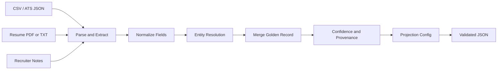

# Multi-Source Candidate Data Transformer - Technical Design

## Goal

Produce one clean, canonical candidate profile from messy structured and unstructured inputs. The pipeline extracts data from CSV, ATS JSON, resume PDF/TXT, and recruiter notes; normalizes fields; deduplicates records that refer to the same person; merges conflicts deterministically; attaches confidence and provenance; and projects the canonical profile into a runtime-configured output schema.

## Pipeline

## Canonical Schema

| Field | Type | Normalization |
| --- | --- | --- |
| full_name | string | Strip salutations, collapse whitespace, title case |
| email | string | Lowercase and validate syntax |
| phone | string | E.164, using phonenumbers when installed |
| country | string | ISO-3166-1 alpha-2 via known aliases |
| skills | list[string] | Synonym map, dedupe, alphabetical sort |
| date_of_birth | YYYY-MM-DD string | dateutil parser |
| experience_yrs | number | Numeric years |

## Entity Resolution

Records are grouped by exact normalized email first, then exact normalized phone, then blocked fuzzy name matching. Name matching is deterministic: exact normalized names, same first name with matching last initial, or a high string-similarity score. Conflicting countries prevent fuzzy name merges unless a stronger key already matched.

## Merge and Confidence Rules

Scalar fields choose the value with the strongest support count, source priority, and deterministic tie-breaker. Names prefer the longest normalized value; phones prefer values with stronger support and longer normalized digits. Skills are a union across all sources. Experience uses the maximum reported years. Confidence is higher when the same value is supported by multiple sources. Provenance stores the exact source tags that contributed the selected value.

## Projection and Validation

The projection JSON controls field selection, field renaming, missing-field behavior (`null`, `omit`, or `error`), and metadata toggles. The internal canonical model remains stable, while projected output is validated with a dynamically generated Pydantic model before being written.
